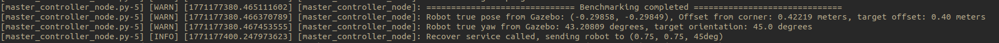

# robust_docking
This repo contains the source code for Gazebo based mobile robot using RANSAC lidar scan and a docking controller to perform robust docking. This is an intervew take home assignment by Certis. 


## Setup
### 1. Clone the repo
```
git clone https://github.com/PiusLim373/robust_docking.git
git submodule update --init --recursive
```
### 2. Build
```
colcon build --symlink-install
```
### 3. Source the built environment, and export Gazebo resources path
```
source install/setup.bash
export GAZEBO_MODEL_PATH=$GAZEBO_MODEL_PATH:$(ros2 pkg prefix master_controller)/share
```

## Run 
### 1. (First terminal) Start the simulation (Gazebo)
```
ros2 launch turtlebot3_gazebo docking_world.launch.py 
```

### 2. (Second terminal) Start the navigations, feature_detector, docking_manager, disturbance_manager, master_controller
```
ros2 launch master_controller bringup.launch.py 
```
### 3. Use RVIZ to send a `Nav2 Goal` toward top left, facing the corner, until the corner_pose is shown


### 4. (Third terminal) Start the docking!
```
ros2 service call /start_corner_docking_smach std_srvs/srv/Trigger
```
### 5. (Upon successful docking) get the benchmark data!
This will be printed on the second terminal


### 6. Send a recovery request to bring the robot back to inital position, or repeat Step 3
```
ros2 service call /recovery std_srvs/srv/Trigger
```

### 7. To turn ON disturbances
```
ros2 service call /toggle_noisy_odom std_srvs/srv/SetBool "{'data': true}" && \
ros2 service call /toggle_crippled_laser std_srvs/srv/SetBool "{'data': true}"
```

### 8. To turn OFF disturbances
```
ros2 service call /toggle_noisy_odom std_srvs/srv/SetBool "{'data': false}" && \
ros2 service call /toggle_crippled_laser std_srvs/srv/SetBool "{'data': false}"
```


:warning: Remember to source the `install/` folder and export `GAZEBO_MODEL_PATH` for these terminals

## Video
[](https://youtu.be/APDEAlVo61Y)

## Results
🎯 Target offset: 0.40 m

🎯 Target yaw: 45.0°
### Without Disturbances
| Run | X (m)     | Y (m)     | Offset (m) | Offset Error (m) | Yaw (°)  | Yaw Error (°) |
|-----|----------|----------|------------|------------------|----------|--------------|
| 1   | -0.28980 | -0.28821 | 0.40872    | +0.00872         | 41.83042 | -3.16958     |
| 2   | -0.28750 | -0.28736 | 0.40649    | +0.00649         | 48.66041 | +3.66041     |
| 3   | -0.28355 | -0.28476 | 0.40186    | +0.00186         | 41.89558 | -3.10442     |
| 4   | -0.29124 | -0.29466 | 0.41430    | +0.01430         | 45.16641 | +0.16641     |
| 5   | -0.28075 | -0.28202 | 0.39794    | -0.00206         | 48.11763 | +3.11763     |
| 6   | -0.29042 | -0.28888 | 0.40962    | +0.00962         | 46.57561 | +1.57561     |
| 7   | -0.28742 | -0.29023 | 0.40846    | +0.00846         | 47.28626 | +2.28626     |
| 8   | -0.28905 | -0.29099 | 0.41015    | +0.01015         | 42.02810 | -2.97190     |
| 9   | -0.28436 | -0.28433 | 0.40212    | +0.00212         | 48.93924 | +3.93924     |
| 10  | -0.28854 | -0.29030 | 0.40930    | +0.00930         | 49.84504 | +4.84504     |

Average offset: ≈ 0.4069 m

Average error: ≈ +0.0069 m

Average yaw: ≈ 46.43°

Average error: ≈ +1.43°
### With Disturbances (Noisy Odom + Scan Corrupt + Scan Dropout)
| Run | X (m)     | Y (m)     | Offset (m) | Offset Error (m) | Yaw (°)  | Yaw Error (°) |
|-----|----------|----------|------------|------------------|----------|--------------|
| 1   | -0.25853 | -0.26124 | 0.36754    | -0.03246         | 50.07812 | +5.07812     |
| 2   | -0.27293 | -0.27822 | 0.38973    | -0.01027         | 49.88943 | +4.88943     |
| 3   | -0.21925 | -0.22576 | 0.31470    | -0.08530         | 47.84581 | +2.84581     |
| 4   | -0.27357 | -0.29137 | 0.39966    | -0.00034         | 48.43563 | +3.43563     |
| 5   | -0.24544 | -0.24379 | 0.34594    | -0.05406         | 43.21767 | -1.78233     |
| 6   | -0.24419 | -0.23806 | 0.34103    | -0.05897         | 41.72788 | -3.27212     |
| 7   | -0.28192 | -0.28422 | 0.40032    | +0.00032         | 48.03754 | +3.03754     |
| 8   | -0.25317 | -0.21875 | 0.33459    | -0.06541         | 43.05832 | -1.94168     |
| 9   | -0.27198 | -0.27020 | 0.38339    | -0.01661         | 41.08680 | -3.91320     |
| 10  | -0.24770 | -0.23925 | 0.34438    | -0.05562         | 52.24093 | +7.24093     |

Average offset: ≈ 0.3621 m

Average error: ≈ -0.0379 m

Average yaw: ≈ 46.96°

Average error: ≈ +1.96°